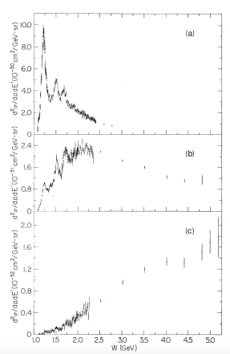
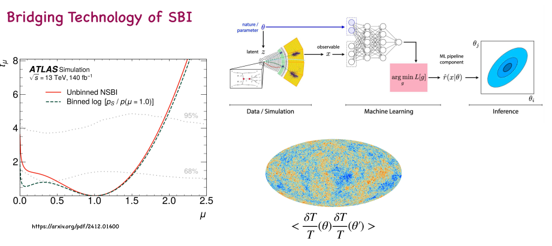
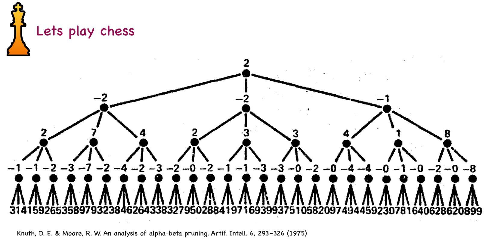
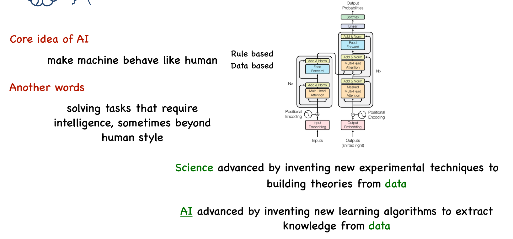

# AI-Driven High Energy Physics (HEP)
## Session 1: Lost in the Forest

### Defining High Energy Physics (HEP)
HEP involves studying fundamental particles and forces, drawing data from various sources and experiments.
### Key Sources and Facilities in HEP: 
HEP phenomena are explored using multiple methods and locations, including:
- Accelerators and Colliders: A notable example is the LHC (Large Hadron Collider).
- Reactors : An example mentioned is KamLand. Beam Dump experiments.
- Astroparticles originating from sources such as the Sun and Cosmic Rays.
- Specific related projects mentioned include Fermi LAT, Super-K, and Borexino.
- Observations related to the Earth.
- Cosmology:Planck-Gravitational Waves-LIGO-Virgo.
#### Exe 1-1: Design a detector for banana cargo at port? (Background free)
### How to use Catalog:

### Classic Example:
A classic example in HEP is the SLAC-MIT DIS (Deep Inelastic Scattering) experiment

Steps in the Traditional Experiment: The traditional experiment requires several distinct processing steps:
Pre-process:
1. Readout.
2. Veto.
3. Trigger.

Post-Process:

4. Parameter Estimation.
5. Hypothesis Testing.

### Modern Example:
A modern example is referenced via the arXiv paper link: https://arxiv.org/abs/1308.044

 In this detector setup, a scintillator is used such that when a neutrino interacts with it, a burst of photons is produced. These photons are then detected by the photosensors inside the detector.

Surrounding the central scintillator volume is a layer of water. This outer water shield helps absorb external radiation—such as cosmic muons—that might otherwise create background signals. When these incoming particles (e.g., muons) enter the water and travel faster than the speed of light in water, they produce Cherenkov radiation. This Cherenkov light can be detected and used to veto events originating from outside the central target volume. In this way, we can effectively distinguish between internal signals (from neutrino interactions) and external background events.

For example, in the observed signal waveform, the first peak corresponds to the initial positron deposit from the neutrino interaction. Approximately 10 microseconds later, the positron annihilates, producing a second peak followed by a characteristic tail—this decay profile reflects the time evolution and completion of the physical process.

Machine learning can leverage this physical understanding to classify events. By using features such as the interaction signature of the positron and the temporal shape of the signal (e.g., peak timing, presence of a delayed tail, pulse width), a model can effectively separate true neutrino-induced events from background or external events.
### Summary of Traditional Experiment Pipeline:

### Bridging Tech of SBI
The core idea is to provide a model or neural network not only with observational data (the "observables") but also with the underlying physical principles. We then train the model to learn the mapping between these observables and the corresponding physical parameters or processes.

Importantly, by "observables" we do not mean raw detector data. Instead, we feed the model higher-level, processed representations—such as full sky maps of the CMB—rather than derived summary statistics like the CMB power spectrum (e.g., the \( C_\ell \) correlation function). The model learns to infer the underlying physics directly from these rich, spatially resolved inputs, and its output is an estimate of the physical parameters or conditions that generated the observed signal.

In essence, the network is trained to answer: “Given this observable map, what physical scenario produced it?”—bypassing traditional intermediate steps and leveraging the full information content of the data.

### What if we reach to the physics directly from raw Data
What if we feed the network the full raw data directly? Could this approach enable the discovery of new physics?

By bypassing traditional preprocessing, feature engineering, or summary statistics—and instead giving the model access to the complete, unfiltered dataset—we allow it to identify subtle, non-linear, or previously unrecognized patterns that might be lost in conventional analysis pipelines. If the underlying physical laws leave imprints in the raw data that don’t conform to our current models, a sufficiently expressive and well-trained network might detect these anomalies and point toward physics beyond the standard paradigm.

In other words, end-to-end learning from raw observables could serve not just as a tool for parameter estimation, but as a hypothesis-free probe for new physics.

## Session 2: Towaed the Summit

This material summarizes **Session 2** of the **AI-Driven HEP Introduction**, presented by S. A. Fard from the School of Physics (IPM). The session is titled **"Toward The Summit"**.

### 1. The Chess Analogy: Finding the Simplest Architecture

Session 2 begins by framing the discussion around artificial intelligence using the game of chess: **"Let's play chess"**.

The initial challenge posed is: **"Find the simplest architecture for a machine playing chess?"**.

#### 1.1 Brute-Force Optimization (MiniMax)

The foundational architectural concept introduced is **Brute-force MiniMax optimisation**.

However, implementing brute-force search quickly reveals complexity challenges:

- To **predict 5 moves ahead**, the number of possible positions falls within the **order of** $\sim 30^{10} \sim 10^{14}$.
- The sources comment that this brute-force method, while simple, is **"made it as simple as possible, but not simplest"**.

#### 1.2 Increasing Complexity: Optimization Techniques

The next step is to **"take one step forward and make the architecture more complex?"**.

The optimization technique introduced is **Alpha–beta pruning**. This technique is described as cutting off **"branches that cannot possibly affect the final decision"**.

The complexity reduction achieved by Alpha–beta pruning is significant, reducing the required calculation order to **order of** $\sim 10^{7}$.

#### 1.3 Incorporating Human Strategy and Cost

Further development involves integrating human-like strategic knowledge, such as **Opening tips** and **Ending Moves**.

The cost of computing power over time is briefly compared:

- **1990**: Computing costs were around $\sim 10^6\ \$$.
- **2020**: Computing costs dropped significantly to around $\sim 10^3\ \$$.

This comparison leads to **Exe 2-1: Estimate GPU cost in the near future**.

### 2. The Go Analogy and Modern AI

The session then moves to applying a **"similar procedure for playing Go!"**.

The complexity of Go far exceeds that of chess:

- The required calculation order for Go is estimated at **order of** $\sim 200^{10} \sim 10^{23}$.

The concept of modern, data-driven Go AI is referenced, citing the Google DeepMind project:  
[https://deepmind.google/research/projects/alphago/](https://deepmind.google/research/projects/alphago/).

Key elements of this AI approach include calculating probability:

- **The probability of moves $a$ at position $s$: $p_{\sigma}(a \mid s)$**.
- Referenced probability orders include **order of 50%**, **order of 80%**, and **order of 20%**.

This discussion sets up **Exe 2-2: Implement the MCTS via a simple Python code**.

### 3. The Core Idea of AI

The session concludes by defining the **Core idea of AI**.

The primary goal of AI is to **"make machine behave like human"**. This goal can be achieved through two primary approaches:

1. **Rule-based**  
2. **Data-based**

In other words, AI involves **"solving tasks that require intelligence, sometimes beyond human style"**.

The sources offer a direct comparison between the advancement of traditional Science and the advancement of AI:

| Field    | Advancement Method                                                                 |
|----------|------------------------------------------------------------------------------------|
| Science  | Advanced by inventing new experimental techniques to build theories from data.     |
| AI       | Advanced by inventing new learning algorithms to extract knowledge from data.      |

## AI-Driven HEP Introduction: Session 3 - Instrument

### References

The material covered in this session draws upon foundational texts in detector physics and astronomy instrumentation:

- Grupen, Claus, and Boris Shwartz. *Particle detectors*. Cambridge University Press, 2008.  
- Ade, Peter A. R., Matthew J. Griffin, and Carole E. Tucker. *Physical principles of astronomical instrumentation*. CRC Press, 2021.  
- Karttunen, Hannu, et al., eds. *Fundamental astronomy*. Berlin, Heidelberg: Springer Berlin Heidelberg, 2007.

---

### 1. Introduction: Interaction and Medium

The concept of a physical instrument, particularly a detector, fundamentally starts with **Interaction & medium**.

#### Key Principle
Every interaction process that occurs between a particle and matter can be utilized as the basis for a detector concept.

#### Main Interactions
The main interaction processes used in detector physics are:

1. **Ionisation**  
2. **Excitation**  
3. **Bremsstrahlung**

#### Particle Detection Requirement
- **Charged particles** (e.g., electrons) can be detected **directly** via these interactions.  
- **Neutral particles** (e.g., photons, neutrinos) must **produce charged particles** through an interaction to be detected.

---

### 2. Detection Regimes: Electromagnetic Waves

Detectors are designed based on the properties of the incoming flux, particularly its **wavelength** and **energy**.

#### A. Radio Photon Regime (Long Wavelength)

- **Energy**: $$( E \sim 10^{-3} \, \text{eV} )$$  
- **Wavelength**: $$( \lambda \sim 1 \, \text{mm} )$$

##### Interaction Medium
Radio photons interact primarily with:
- Conducting material (metal)  
- Plasma (Earth’s ionosphere)

##### Ionospheric Limitation
Ground-based radio astronomy is **not possible** for wavelengths longer than the Earth’s ionospheric plasma wavelength ($(\sim 24 \, \text{m}$), or frequency $(\sim 13 \, \text{MHz}$)).

The **plasma frequency** ($(\nu_p$)) relates to electron number density ($(n_e$)) by:  
$$[
\nu_p \sim 9 \sqrt{n_e}
]$$

  

##### Coherent vs. Incoherent Detection
- **Coherent detection**: Used for radio/microwaves; measures **amplitude and phase**.  
- **Incoherent (direct) detection**: Used at shorter wavelengths; measures only **intensity (power)**, ignoring phase.

  

---

#### B. IR–Optical–UV Regime (Mid-Range Wavelength)

- **Photon energy**: $( E \sim 1 \, \text{eV} )$ to $( 10 \, \text{eV} )$

##### Interaction
Detection relies on **photon absorption**.

##### Material Response
High-conductivity materials act as **mirrors** in this energy range.

##### Bolometric Detectors
- Measure energy by detecting a **temperature rise** in a resistive material.

##### Photodetectors
- Use absorbed photon energy to create **charge carriers** (electrons/holes) under an electric field.  
- Common materials: **InSb** (Indium Antimonide), **InP** (Indium Phosphide), **GaAs** (Gallium Arsenide).

  

---

### 3. Photodetector Characteristics and the Photoelectric Effect

#### Detector Responsivity
Responsivity quantifies **current output per unit incident power**, depending on:

- $( \eta_d )$: Probability an incident photon liberates an electron  
- $( g )$: Photoconductive gain (material- and field-dependent)
* The Ideal of this part is that the Responsivity becomes high.

### The Photoelectric Effect
Electrons are emitted from a metal surface when exposed to light of sufficient frequency:

$[
K_{\text{max}} = h\nu - W
]$

- $( h\nu )$: Photon energy  
- $( W )$: Work function of the material  
- Requires $( h\nu \geq W )$

#### Interaction Probability
Photoabsorption probability per unit mass scales as:

$[
\propto \frac{Z^5}{E^{7/2}}
]$

**Implications**:
1. **High-Z materials** are far more efficient absorbers.  
2. Absorption probability **drops rapidly** with increasing photon energy.

  

---

### 4. The Photomultiplier Tube (PMT)

A **PMT** converts low-intensity light into a measurable current via electron multiplication.

- A single photon on the **photocathode** can generate $(\sim 10^5)$ electrons through **dynode stages** (secondary emission).

  

#### Dark Current
Unwanted internal current due to:
- Thermal electron emission from the photocathode  
- Spurious ionizing events

#### Dark Current Mitigation

1. **Optimal Voltage Selection $((V_{\text{opt}})$)**  
   - Below $(V_{\text{opt}})$: signal too weak  
   - Above $(V_{\text{opt}})$: dark current dominates

2. **Cooling**  
   - Typical ly cooled to **−20°C**  
   - Exponentially suppresses thermal emission

3. **Pulse Discrimination**  
   - Use **pulse height analysis** to reject noise events\

## AI-Driven HEP Introduction: Session 4 – Instrument II

### References

This session builds on foundational texts in detector physics and astronomical instrumentation:

- Grupen, Claus, and Boris Shwartz. *Particle detectors*. Cambridge University Press, 2008.  
- Ade, Peter A. R., Matthew J. Griffin, and Carole E. Tucker. *Physical principles of astronomical instrumentation*. CRC Press, 2021.  
- Karttunen, Hannu, et al., eds. *Fundamental astronomy*. Springer Berlin Heidelberg, 2007.

---

### I. General Detector Principles

The foundation of all detector instrumentation lies in **Interaction & medium**.

  

#### Core Principle
> **Every interaction process between a particle and matter can serve as the basis for a detector concept.**

#### Primary Interaction Mechanisms
- **Ionisation**  
- **Excitation**  
- **Bremsstrahlung**

#### Detection of Neutral Particles
- **Charged particles** (e.g., electrons) interact directly and are detectable.  
- **Neutral particles** (e.g., photons, neutrinos) **must produce charged secondary particles** through an interaction to be observed.

---

### II. High-Energy Photon Interactions

At higher energies, photons interact via three key processes:

#### 1. Compton Scattering
- **Energy range**: $( \sim 10 \, \text{keV} )$ to $( 10 \, \text{MeV} )$  
- A high-energy photon (X-ray or γ-ray) **scatters off a free or loosely bound electron**, losing energy and increasing in wavelength.  
- The wavelength shift is given by:  
  $[
  \Delta \lambda = \frac{h}{m_e c} (1 - \cos \theta)
  ]$

  

#### 2. Inverse Compton Scattering
- A **low-energy photon** (e.g., microwave or optical) **gains energy** by scattering off a **relativistic electron**.

#### 3. Pair Production
- Occurs at photon energies **$( \gtrsim 100 , \text{MeV} )$**.  
- The photon converts into an **electron–positron pair** in the Coulomb field of a nucleus.

  

Note: Photons above a certain energy threshold are no longer stable and therefore cannot be observed.

#### Detection Strategy
The **charged particles** produced in these interactions (e.g., recoil electrons from Compton scattering, e⁺e⁻ pairs from pair production) are detected via their **ionisation** in the detector’s sensitive volume.

---

### III. Energy Loss by Charged Particles

As charged particles traverse matter, they lose kinetic energy through several mechanisms:

#### 1. Ionisation and Excitation
- The **dominant energy loss mechanism** at non-relativistic and moderately relativistic energies.  
- Caused by Coulomb interactions with atomic electrons, leading to excitation or ejection (ionisation).

#### 2. Electromagnetic Radiation
- Any **accelerated charged particle** emits radiation. Key examples:
  - **Cherenkov radiation**: emitted when particle velocity exceeds light speed in the medium.  
  - **Synchrotron radiation**: emitted by relativistic particles in magnetic fields (curved trajectories).

#### 3. Example: Energy Transfer by a Muon
- A muon with mass $( m_\mu = 106 \, \text{MeV}/c^2 )$ and Lorentz factor $( \gamma = 10 )$ (total energy $( E = 1.06 \, \text{GeV} )$) can transfer up to **$( \sim 100 \, \text{MeV} )$** to an atomic electron in a single collision.

  

Note: The position of the trough indicates the point beyond which the particle becomes relativistic. However, it should be noted that while the output plot shown has been smoothed, the raw data may exhibit some fluctuations.

  

Note: The heavier the particle, the more the relativistic transition trough shifts to the right. 

# Selected Particle Masses and Properties in Particle Physics

The table below lists well-known elementary and composite particles in the Standard Model and beyond, along with their approximate rest masses and key properties. Masses are given in energy units (MeV/$c^2$ or GeV/$c^2$), as is conventional in high-energy physics.

| Particle        | Symbol | Mass (MeV/$c^2$) | Electric Charge ($e$) | Spin | Type             | Notes |
|-----------------|--------|------------------|------------------------|------|------------------|-------|
| Electron        | $e^-$  | 0.511            | $-1$                  | 1/2  | Lepton           | Stable; lightest charged lepton |
| Muon            | $\mu^-$| 105.7            | $-1$                  | 1/2  | Lepton           | Decays via weak interaction ($\tau \approx 2.2\,\mu$s) |
| Tau             | $\tau^-$| 1777            | $-1$                  | 1/2  | Lepton           | Heaviest lepton; short-lived |
| Electron Neutrino | $\nu_e$ | < 0.8 eV       | 0                      | 1/2  | Lepton           | Extremely light; only interacts weakly |
| Muon Neutrino   | $\nu_\mu$ | < 0.3 eV       | 0                      | 1/2  | Lepton           | Mass not precisely known |
| Tau Neutrino    | $\nu_\tau$| < 18 eV        | 0                      | 1/2  | Lepton           | Heaviest neutrino (still very light) |
| Up quark        | $u$    | $\sim 2.2$       | $+2/3$                | 1/2  | Quark            | Constituent of protons/neutrons |
| Down quark      | $d$    | $\sim 4.7$       | $-1/3$                | 1/2  | Quark            | Constituent of protons/neutrons |
| Strange quark   | $s$    | $\sim 96$        | $-1/3$                | 1/2  | Quark            | Found in kaons, hyperons |
| Charm quark     | $c$    | $\sim 1275$      | $+2/3$                | 1/2  | Quark            | Discovered 1974; forms $J/\psi$ |
| Bottom quark    | $b$    | $\sim 4180$      | $-1/3$                | 1/2  | Quark            | Key in CP-violation studies |
| Top quark       | $t$    | $\sim 172{,}500$ | $+2/3$                | 1/2  | Quark            | Heaviest known elementary particle; decays before hadronizing |
| Photon          | $\gamma$| 0                | 0                      | 1    | Gauge boson      | Mediator of EM force; stable |
| $W$ boson       | $W^\pm$| 80{,}400         | $\pm 1$               | 1    | Gauge boson      | Mediator of weak force; short-lived |
| $Z$ boson       | $Z^0$  | 91{,}200         | 0                      | 1    | Gauge boson      | Neutral weak current mediator |
| Gluon           | $g$    | 0                | 0                      | 1    | Gauge boson      | Mediator of strong force; confined |
| Higgs boson     | $H^0$  | 125{,}100        | 0                      | 0    | Scalar boson     | Gives mass via Higgs mechanism |
| Proton          | $p$    | 938.3            | $+1$                  | 1/2  | Baryon (composite)| Stable (lifetime > $10^{34}$ yr) |
| Neutron         | $n$    | 939.6            | 0                      | 1/2  | Baryon (composite)| Free neutron decays in $\sim 880$ s |
| Pion (charged)  | $\pi^\pm$| 139.6           | $\pm 1$               | 0    | Meson (composite)| Lightest meson; mediates nuclear force |
| Pion (neutral)  | $\pi^0$| 135.0            | 0                      | 0    | Meson (composite)| Decays to photons ($\tau \sim 8 \times 10^{-17}$ s) |

> **Notes**:
> - Quark masses are *current quark masses* in the $\overline{\text{MS}}$ scheme at scale $\mu \approx 2$ GeV.
> - Neutrino masses are upper limits from oscillation and cosmological data; absolute values are not yet known.
> - Composite particles (e.g., proton, pion) are made of quarks bound by gluons.
> - All masses are approximate and may vary slightly depending on measurement or convention.

#### 4. Landau Distribution
- Describes the **statistical fluctuations** in energy loss for thin absorbers.  
- Characterizes the **asymmetric distribution** of energy deposition, with a long tail toward higher energy losses.  
- The **most probable energy loss** (not the mean) is often used as a reference in detector calibration.

  

## AI-Driven HEP Introduction: Session 5 – Electronic

### References

This session continues the "AI-Driven HEP Introduction" series by **S. A. Fard** (School of Physics, IPM), drawing on foundational texts:

- Grupen, Claus, and Boris Shwartz. *Particle detectors*. Cambridge University Press, 2008.  
- Ade, Peter A. R., Matthew J. Griffin, and Carole E. Tucker. *Physical principles of astronomical instrumentation*. CRC Press, 2021.  
- Karttunen, Hannu, et al., eds. *Fundamental astronomy*. Springer Berlin Heidelberg, 2007.

---

### I. Measurement of a Physical Parameter

The essence of physical measurement is the **conversion of an input quantity into an easily measurable output quantity**.  
Example:  
$[
\text{Photon} \rightarrow \text{voltage or current}
]$

#### Detector Types and Their Output Quantities

| Detector Type               | Input / Principle                                | Output Quantity                                      |
|----------------------------|--------------------------------------------------|------------------------------------------------------|
| **Photoconductive**        | Photon rate incident on detector                | **Current** ∝ photon rate                           |
| **Photovoltaic**           | Photon rate                                     | **Voltage** ∝ photon rate                           |
| **Radio antenna**          | Amplitude of incident electric field            | **Current** ∝ field amplitude                       |
| **Bolometric detector**    | Absorbed electromagnetic power                  | **Temperature change** ∝ power (often converted to voltage) |
| **Charge Coupled Device (CCD)** | Number of incident photons during exposure | **Charge** ∝ number of photons                      |

> The **Ionisation Chamber** is also mentioned as a fundamental detector type in this context.

  

---

### II. The Signal, the Background, and the Noise

Three essential components define any measurement system:

#### A. Signal
- The **desired output** of the measurement.
- Two roles:
  1. **Known signal**: Used to calibrate and establish **sensitivity**.
  2. **Unknown signal**: Represents a potential **anomaly** or new physics.

#### B. Background
- An **unavoidable accompaniment** to the signal.
- Often **much larger in magnitude** than the signal itself.
- Typically has a **known functional form and variation** (e.g., cosmic rays, ambient radiation).

#### C. Noise
- **Unwanted random fluctuations** that introduce **uncertainty** in measurements.
- Affects both sensitivity (known signal) and anomaly detection (unknown signal).
- **Sources of noise**:
  1. **Signal** (intrinsic statistical fluctuations, e.g., Poisson noise)
  2. **Detector** (e.g., thermal noise, dark current)
  3. **Electronics** (e.g., amplifier noise, Johnson–Nyquist noise)

> Noise is fundamentally a **stochastic (random) process**.
Noise is the square root of the number of signals per unit time.
$$
\text{Noise} = \sqrt{N}
$$
where N is the number of signal events in a given time interval.
---

### III. Noise Management and Electronic Processing

#### Noise Handling Strategies

| Noise Source                          | Mitigation Strategy                                                                 |
|--------------------------------------|--------------------------------------------------------------------------------------|
| **Signal fluctuations**              | **Cannot be eliminated**—inherent to quantum/statistical nature of the signal.        |
| **Background fluctuations**          | **Minimized by reducing background** (shielding, coincidence cuts, etc.).            |
| **Detector & electronics noise**     | **Reduced via**: low-noise components, cooling, optimized circuit design, grounding. |

This noise primarily arises from:
- **Detector readout electronics**
- **Amplifiers and signal-processing circuits**

#### Key Electronic Concepts

#### 1. Responsivity
- Defined as output current per unit incident power (from Session 3).
- **High responsivity is desirable**, but **does not guarantee high sensitivity** if noise is large.
$$
S = \frac{\text{Change in output quantity}}{\text{Change in input quantity}}
$$

  

  

If the incoming frequency is much larger than the circuit’s characteristic frequency, the denominator becomes effectively infinite, so \( V_{\text{out}} \to 0 \)—meaning no response, i.e., a **low-pass filter** behavior.

Conversely, if the frequency is much smaller than the circuit’s time scale, the signal passes through unaffected—i.e., **high-pass filter** behavior.

#### 2. Signal-to-Noise Ratio (SNR)
- Noise $( f(t) )$ is modeled as a **random variable** with:
  - Mean = 0  
  - Variance = $( \sigma^2 )$ (called **noise power**)
- Example: $( \text{SNR} = 20 )$ indicates the signal is 20 times stronger than the RMS noise.

  

In the ideal case, the amplitude follows a Gaussian distribution, and the noise power is equal to the variance of that Gaussian amplitude, as illustrated in Figure B.
#### 3. Filtering and Signal Shaping
- **Low-pass filters**: suppress high-frequency noise.
- **High-pass filters**: remove slow drifts or DC offsets.
- **Integration–differentiation techniques** are used to:
  - **Integrate** slow (low-frequency) components for energy measurement.
  - **Differentiate** fast (high-frequency) components for timing or pulse detection.

  

## Comprehensive Analysis of Statistical Concepts: Tutorial 2- Dr.Jalali's presentation

### Slide 1: Data Modeling, Parameter Estimation, and Optimization

This initial slide sets the stage for scientific inference by posing the core methodological challenges:

  

1. **Data Modeling:** The key objective is to determine **"How can this observation be described using a given physical model M with free parameters $\theta$?"**. The parameters ($\theta$) are the unknown variables of interest within the model.
2. **Criterion:** To assess the validity of the model, a **"criterion for assessing the similarity between data and model"** must be established. This metric quantifies **"How well the model predicts the observed data?"**.
3. **Optimization:** The ultimate goal is **Optimization**, which aims to find the **"Best Value"** for the parameters $\theta$ by optimizing the defined criterion (e.g., maximizing similarity or minimizing a loss function).
4. **Error Estimation:** After the best parameter value is found, **Error Estimation** is required to quantify the uncertainty associated with the determined values of $\theta$.
5. **Probabilistic Approach Introduction:** The solution framework begins with the **Probabilistic Approach**. This approach is founded on the concept of the **Likelihood**, which is defined as the **"Probability of observing the data given a specific parameter value"**.

  

center>
  

  

  

  

  

  

  

  

### Slide 2: Probabilistic Approach, Central Limit Theorem, and Machine Learning

The second segment expands on the probabilistic foundation and links it to computational methods.

- **Likelihood and CLT:** The **Likelihood**—the probability $P(\text{Data} \mid \theta)$—is the central tool in the probabilistic approach. The **Central Limit Theorem** (CLT) is mentioned in this context, often serving as the theoretical justification for assuming a **Gaussian Likelihood** when dealing with errors resulting from the sum of many independent random effects.
- **Machine Learning as Optimization:** The source clearly states that **"Machine Learning Is Nothing But Optimization"**. In training a model, the goal is to optimize a **Loss Function** using **"Training Data + Labels"**. The data flows through **Input** components and **Hidden Layers** to generate **Outputs** which are compared against the **Labels**.

  

### Slides 2–4: Frequentist Approach vs. Bayesian Approach Comparison

The subsequent slides delineate the fundamental philosophical and practical differences between the two major schools of statistical inference:

| Aspect | Frequentist Approach | Bayesian Approach |
| :--- | :--- | :--- |
| **Philosophy** | **Parameters ($\theta$) are fixed but unknown constants**; randomness stems exclusively from the data. | **Parameters are random variables** characterized by probability distributions. |
| **Probability Interpretation** | Defined as the **"Long-run frequency of outcomes over repeated experiments"**. | Represents the **"Degree of belief or uncertainty about parameters,"** which is noted to align better with intuitive understanding. |
| **Parameters ($\theta$)** | Treated as **fixed, unknown quantities**. | Treated as **random variables with prior distributions**. |
| **Prior Information** | **Not used**; inference is based **solely on data**. | **Explicitly included** in the analysis. |
| **Core Objective** | To **"Estimate $\theta$ using data only"**. | To **"Update prior distribution to posterior using data"**. |
| **Hypothesis Testing** | Based on **p-values and rejection of null hypotheses**. | Based on **posterior probabilities and model comparison** (e.g., Bayes factor). |
| **Common Tools** | **MLE** (Maximum Likelihood Estimation), **confidence intervals, p-values, likelihood ratio tests**. | **Bayes’ theorem, priors, posteriors, MCMC, variational inference**. |
| **Computation** | Often **simpler and faster**; analytic solutions available for many problems. | Can be **computationally intensive, especially in high dimensions**. |
| **Typical Use Cases** | **Classical experiments, large-sample statistics, regulated fields** (e.g., pharma). | **Complex models, small datasets, simulation-based inference, hierarchical models**. |

### Slide 5: The Bayesian Approach and Bayes' Theorem

This slide formalizes the structure of Bayesian inference. The process involves **Observation, Adopting Model, and Estimating Parameters**.

Bayes' theorem defines the relationship between the three core probabilistic components:

$$
\text{Posterior} \propto \text{Likelihood} \times \text{Prior}
$$

1. **Prior Distribution (Prior):** This represents **"Your initial belief about a parameter before seeing any data"**.
2. **Likelihood:** This is the **"Probability of observing the data given a specific parameter value"** ($P(\text{Data} \mid \theta)$).
3. **Posterior Distribution (Posterior):** This represents **"Your updated belief about the parameter after seeing the data"** ($P(\theta \mid \text{Data})$).

  

  

### Slide 6: Traditional Bayesian Inference and Analytical Solutions

This section addresses the requirements and initial methods of calculating the posterior.

- **Traditional Requirement:** Classical Bayesian methods (Traditional Bayesian Inference) necessitate **"an explicit analytical form of how the data depends on the parameters $\theta$ in order to compute the likelihood"**.
- **Analytical Solution:** This is a **"closed-form approach to compute the posterior distribution exactly"**. It is only applicable when both the **prior and likelihood are mathematically tractable**.
- **Grid-based Methods:** These involve **discretizing the parameter space into a grid** and **evaluating the posterior at each point**. They are considered **simple and intuitive** and **useful for low-dimensional problems**, but they are **computationally expensive in high dimensions**.

  

  

  

### Slide 7: Approximate and Sampling Methods

When analytical or grid-based solutions are infeasible, approximate and sampling methods are utilized:

1. **Variational Inference (VI):** This is an **approximate Bayesian inference method**. It works by **replacing a complex posterior distribution with a simpler, parameterized distribution** and then **optimizing that approximation**.
2. **Sampling-Based Methods:** These methods aim to **approximate the posterior distribution by generating a large number of representative samples from it**.
    - Sub-categories include **Rejection Sampling**, **Importance Sampling**, and **MCMC Methods** (Markov Chain Monte Carlo).
    - Key MCMC algorithms are listed: **Metropolis-Hastings**, **Gibbs Sampling**, **Hamiltonian Monte Carlo (HMC)**, and **NUTS (No-U-Turn Sampler)**.

  

### Slides 8–9: Simulation-Based Inference (SBI) Framework

The final concept introduced is the **Simulation-Based Inference (SBI) Framework**, designed for models where the likelihood cannot be computed explicitly.

- **Gaussian Likelihood Justification:** The **Gaussian likelihood** is often justified by the **Central Limit Theorem**. The **Metropolis-Hastings Markov Chain Monte Carlo (MCMC)** method is noted as a core tool for sampling the **Estimated Posterior**.

  

  

  

- **Forward Modeling:** This is the starting point for SBI. It describes the process of generating data $D$ (or a **summary statistic**) given a set of parameters $\theta$, represented as $D(\theta)$.

  

- **Emulators (Surrogate Models):** These models are used to mimic or replace the complex forward model $D(\theta)$. They take the parameter $\theta$ as **Input** and typically involve **Hidden Layers** to produce the simulated **Outputs**.

  

  

- **Inference Pipeline:** In SBI, parameters are first sampled from the **Prior**. The parameters are fed into the **Forward Modeling** or **Emulators** to generate a **summary statistic**. This summary statistic is then compared to the **Observation** using an **Inference** technique (e.g., **MCMC**) to yield a **Posterior sample**.

  

- **Conclusion:** The process concludes with an acknowledgment of the **Assumed Likelihood** used in the analysis.

  

## AI-Driven HEP: Session 6 - Statistical Learning

### Title Slide

This session, titled **"Statistical Learning"**, is part of the **AI-Driven High Energy Physics (HEP)** lecture series. It is presented by **S. A. Fard** from the **School of Physics, Institute for Research in Fundamental Sciences (IPM)**.

---

### Core References (Part 1)

The session builds upon foundational and modern textbooks in statistical and machine learning:

- **James, Gareth, et al.** *An Introduction to Statistical Learning: With Applications in Python.* (2023)  
- **Hastie, Trevor, et al.** *The Elements of Statistical Learning: Data Mining, Inference, and Prediction.* (2009)  
- **Bishop, Christopher M.** *Pattern Recognition and Machine Learning.* Springer, (2006)  
- **Chollet, François.** *Deep Learning with Python.* (2021)

These texts provide the theoretical and practical backbone for statistical learning methodologies used across scientific domains, including HEP.

---

### Additional References (Part 2)

Further references include theoretical machine learning resources and domain-specific documents from the **DUNE collaboration**:

- **Shalev-Shwartz, Shai, and Shai Ben-David.** *Understanding Machine Learning: From Theory to Algorithms.* (2014)  
- **Tingjun Yang,** *A Brief Description of Data Products,* ProtoDUNE Analysis Workshop, CERN (January 27, 2019)  
- **Gabriela Vitti Stenico,** *Development of the Computing Framework for Monitoring the Quality of ProtoDUNE Off-line Data,* DUNE Collaboration Meeting (2025)

These materials bridge general machine learning theory with real-world applications in particle physics experiments.

---

### hanging the Mindset

Before diving into technical content, a conceptual reset is encouraged:

1. **Take a deep breath**  
2. **Forget everything you’ve heard so far**  
3. **“You are going to be a data scientist from now on.”**

This mindset shift emphasizes adopting a data-centric, model-driven perspective essential for modern scientific analysis.

---

### What Is Statistical Learning?

Statistical Learning explores the relationship among three core elements:

- **(Input) $X$**  
- **(Uncertainty) $\epsilon$**  
- **(Output) $Y$**

This is often framed as modeling the underlying function $f$ such that:
$$
Y = f(X) + \epsilon
$$

#### Terminology:
- **Output ($Y$)**: Also known as the **response**, **dependent variable**, or **target**.  
- **Input ($X$)**: Referred to as **predictors**, **independent variables**, or **features**.

---

### Formal Definition and Learning Framework

**Statistical learning** is formally defined as:
> “A set of approaches for estimating $f$.”

To operationalize this estimation, a complete learning framework consists of six interconnected components:

1. **Input** – The data fed into the system (e.g., features, measurements)  
2. **Architecture** – The structure of the model (e.g., neural network, decision tree)  
3. **Output** – The prediction or result produced by the model  
4. **Supervision** – Whether labels are provided (supervised vs. unsupervised)  
5. **Task** – The objective (e.g., classification, regression, clustering)  
6. **Optimization** – The method used to adjust model parameters (e.g., gradient descent)

These components collectively define how a statistical learning system is designed, trained, and evaluated.

---

### Input Structure

A key practical consideration is: **“What does an input look like?”**

In computational implementations—especially in deep learning—the input is typically represented as a **multidimensional array** (tensor).

Common shapes include:

- `(n, m, l, k)` — General 4D tensor (e.g., batch × height × width × channels)  
- `(n, 1, 1, k)` — Simplified spatial dimensions (e.g., tabular data reshaped for CNNs)  
- `kn` — Flattened representation (e.g., vectorized input of length $k \times n$)  
- `(n, 1, l, k)` — Partially structured input (e.g., time-series or 1D signals with channel depth)

Here:
- `n` often denotes the **number of samples** (batch size)  
- Other dimensions (`m`, `l`, `k`) represent spatial, temporal, or feature axes depending on context

Understanding input geometry is crucial for selecting appropriate architectures and preprocessing pipelines.

## AI-Driven HEP: Session 7 - Statistical Learning II

## Title Slide

This session, titled **"Statistical Learning II"**, is the continuation of the **AI-Driven High Energy Physics (HEP)** lecture series. It is presented by **S. A. Fard** from the **School of Physics, Institute for Research in Fundamental Sciences (IPM)**.

---

### References

The session builds on the same foundational literature as Session 6, including both general machine learning texts and HEP-specific resources:

- **James, Gareth, et al.** *An Introduction to Statistical Learning: With Applications in Python.* (2023)  
- **Hastie, Trevor, et al.** *The Elements of Statistical Learning: Data Mining, Inference, and Prediction.* (2009)  
- **Bishop, Christopher M.** *Pattern Recognition and Machine Learning.* Springer, (2006)  
- **Chollet, François.** *Deep Learning with Python.* (2021)  
- **Shalev-Shwartz, Shai, and Shai Ben-David.** *Understanding Machine Learning: From Theory to Algorithms.* (2014)  
- **Tingjun Yang,** *A Brief Description of Data Products,* ProtoDUNE Analysis Workshop, CERN (January 27, 2019)  
- **Gabriela Vitti Stenico,** *Development of the Computing Framework for Monitoring the Quality of ProtoDUNE Off-line Data,* DUNE Collaboration Meeting (2025)

---

### What Does an Input Look Like? — Beyond Regular Grids

While traditional inputs are often represented as dense arrays with shape `(n, m, l, k)` (e.g., images or structured tensors), **real-world scientific data frequently violates this assumption**.

Key challenges arise when:
- **The organized `(m, l, k)` data format no longer works**  
- Data becomes **sparse**, **irregular**, or **non-Euclidean**

Examples of such data include:
- **Sparse images** (e.g., particle detector hits with mostly empty space)  
- **Sequences of words** (e.g., natural language or symbolic event logs)  
- **Graphs** (e.g., particle interaction networks, detector geometries)

---

### Graph Format as Input

In many HEP applications, data is naturally represented as a **graph**:
- **Nodes** represent entities (e.g., detector channels, particles)  
- **Edges** represent relationships or interactions

A graph is typically described by:
- **Node feature matrix** `X` (e.g., `X = [47, 18, 13, 56, 36, 32, 99, 54, 2]`)  
- **Adjacency matrix** `A`, indicating connections between nodes  
- **Edge attributes** `E`, possibly weighted (e.g., `(11,12): w₂`)

This representation relaxes the rigid grid assumption and allows modeling of **complex relational structures**.

---

### Text Format as Input

Another important input modality is **text**, which appears in metadata, logs, or symbolic representations of events.

Key questions in text modeling:
- **How much does word order affect understanding?**  
- **How are word similarities captured?**  
- **How does context influence meaning?**

Challenges include:
- **Vocabulary size**: ~10⁵ unique English words vs. ~10¹⁵ total word occurrences on the web  
- **Semantic similarity**: Words like “electron” and “muon” may be functionally similar in HEP despite different surface forms  
- **Context dependence**: The same word may have different meanings in different experimental contexts

Text must be transformed from **natural language** into **machine-readable representations** (e.g., embeddings).

---

### Domain of the Data

Regardless of format (array, graph, or text), all inputs are assumed to originate from a **data domain** characterized by:

- **Distribution**: The underlying probability distribution from which data is drawn  
- **Uncertainty**: Inherent noise or variability in observations  
- **I.I.D. assumption**: Data points are often assumed to be **Independent and Identically Distributed**—though this may not hold in HEP (e.g., correlated detector noise, systematic shifts)

---

### Prediction (Inference) and Model Evaluation

The ultimate goal of statistical learning is **prediction** (or **inference**): using a learned model to make accurate predictions on new, unseen data.

Key theoretical concepts include:
- **Maximum Likelihood Estimation (MLE)**: Under Gaussian noise assumptions, MLE reduces to **minimizing the squared error loss**  
- **Bias-Variance Tradeoff**: A fundamental tension between:
  - **Bias**: Error from oversimplifying the model  
  - **Variance**: Error from overfitting to training data

Balancing this tradeoff is essential for **generalization**—ensuring models perform well beyond the training set.

---

### Incompleteness and Generalization

Real-world datasets are often:
- **Incomplete** (missing features, partial observations)  
- **Non-stationary** (domain shifts over time or between experiments)

Thus, robust statistical learning in HEP requires:
- Careful validation strategies  
- Domain adaptation techniques  
- Uncertainty quantification in predictions

These considerations ensure that models remain **reliable, interpretable, and physically meaningful** in high-stakes scientific contexts.